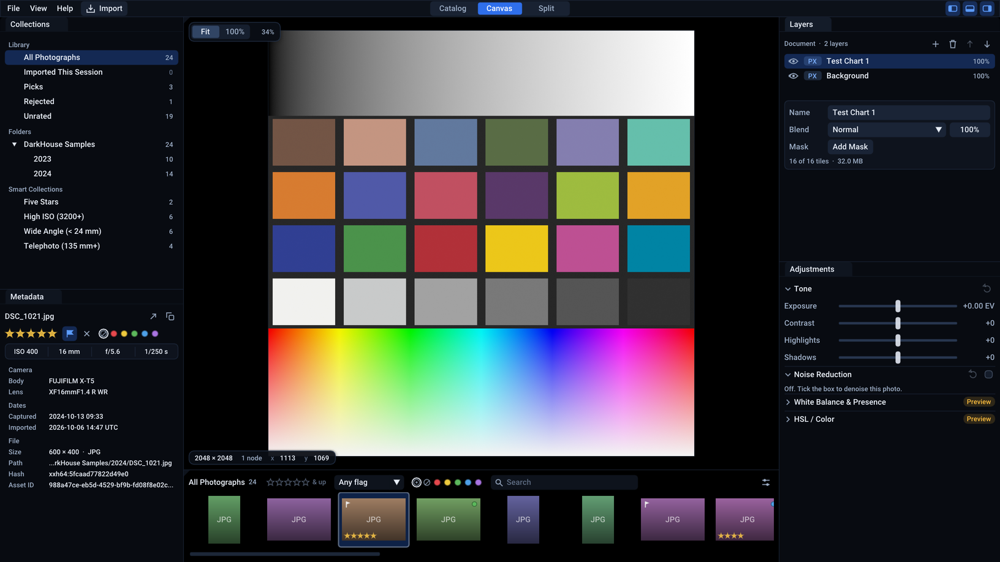
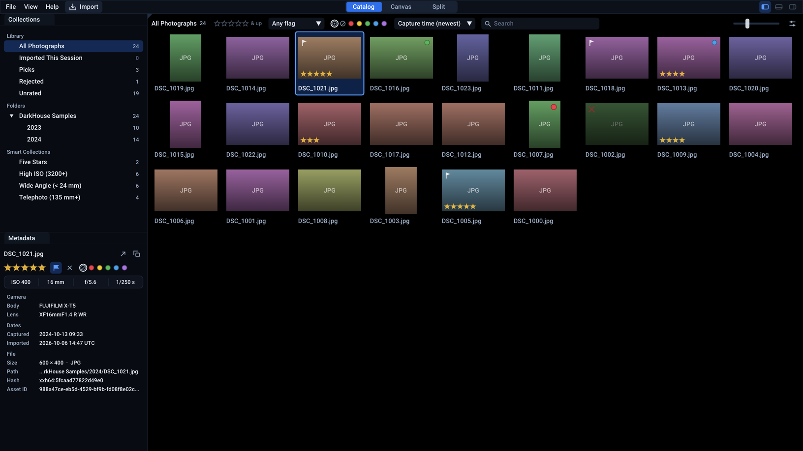

# DarkHouse

DarkHouse combines four desktop imaging tools in one application: a
**non-destructive RAW developer**, a **high-throughput digital asset manager
(DAM)**, a **layered pixel compositor** and a **vector designer**. They share one
catalog, one GPU pipeline and one document model.

Stack: C++20 · CMake ≥ 3.22 · SQLite 3 (WAL) · Vulkan 1.3 / SPIR-V ·
GLFW · Dear ImGui (docking, Vulkan backend with dynamic rendering) · GLM ·
ONNX Runtime



---

## Design principles

1. **Originals are never modified.** Every edit is data. A develop stack is an
   ordered list of `(node_type, serialized_params)` rows in `edit_nodes`, and
   layers reference catalog assets instead of copying pixels. Exporting renders
   the stack again.
2. **The catalog comes first and is the source of truth.** One SQLite file in
   WAL mode. Imports hash and parse metadata in parallel on a worker pool, and
   only the final `INSERT` is serialized. The UI reads through a separate
   read-only connection, so browsing never waits for an import.
3. **Content identity, not path identity.** Assets are deduplicated by an XXH64
   content hash, so importing the same file again returns the existing record.
   Asset IDs are UUIDs that stay the same when files move.
4. **Scene-referred, GPU-first pixels.** The pipeline works in linear light,
   RGBA16F end to end. Operators are Vulkan compute nodes in a DAG with
   synchronization2 barriers, recorded into one command buffer per evaluation.
5. **Sparse by default.** Raster layers are maps of 512×512 FP16 tiles that are
   only allocated when painted. Writes mark tiles dirty, and only dirty tiles
   are re-uploaded to the GPU.
6. **One document model.** Adjustments, pixels, vector shapes and smart objects
   are all `LayerNode`s in one tree, with isolated groups and non-destructive
   masks.
7. **Optional subsystems degrade on their own.** Only the catalog is required.
   If there is no Vulkan device, the app runs in catalog-only mode. If ONNX
   Runtime or the models are missing, AI selection is off. Failures are logged,
   not fatal.
8. **One device for pixels and pixels-on-screen.** The desktop UI renders with
   the same `VkDevice` and queue as the develop graph, so the viewport samples
   develop outputs directly: no copies, no cross-queue ownership transfers.

## Architecture

```
            ┌──────────────────────────── GuiEngine (FrontEnd) ─────────────────────────────┐
            │ PlatformWindow (GLFW) · Swapchain (FIFO/mailbox, 2 frames in flight)          │
            │ Dear ImGui: GLFW platform + Vulkan renderer (dynamic rendering), docking      │
            │ GuiLayer = DarkHouseShell: toolbar (menus · Import · workspace switcher) ·    │
            │            WorkspaceLayoutManager · panels · LibraryModel (view model)        │
            └───────────────┬───────────────────────────────▲───────────────────────────────┘
               AppEvents    │                               │  FrameContext (mode, canvas texture)
                            ▼                               │
                         ┌──────────────────────────────────┴┐
                         │           DarkHouseApp            │  modes: CATALOG | CANVAS | HYBRID_SPLIT
                         │ event queue → frame loop → pacing │
                         └──┬─────────┬─────────┬────────────┘
                            │         │         │
              ┌─────────────▼──┐ ┌────▼──────┐ ┌▼──────────────────────┐
              │  AssetManager  │ │ LayerNode │ │  RenderPipelineGraph  │
              │ SQLite WAL,    │ │ tree +    │ │  ComputeNode DAG      │
              │ import pool,   │ │ Sparse-   │ │  (ExposureNode, ...)  │
              │ EXIF, XXH64    │ │ Raster-   │ │  on VulkanContext ◄───┼── shared with the UI
              └────────────────┘ │ Layer     │ └───────────▲───────────┘
                                 └────┬──────┘   dirty FP16 tiles → GPU upload
                                      └──────────────────────┘
                     AISegmentationEngine (ONNX Runtime) → masks
```

| Path | Responsibility |
| --- | --- |
| `schema/catalog.sql` | Catalog schema: `assets`, `metadata`, `edit_nodes`, indexes. Embedded into the binary at configure time. |
| `include/asset_manager.hpp` | `AssetRecord` / `AssetMetadata`, async `importFile()`, parameterized `queryAssets()`, ratings/flags/labels, edit stacks. |
| `include/import_scan.hpp` | Expands files and folders into importable image paths (CLI `--import`, Import dialog, drag and drop). |
| `include/vulkan_context.hpp` | `PixelFormat`, `GPUTexture`, `VulkanContext` (instance, device, queue, optional window surface, validation messenger, textures, uploads) and synchronization2 barrier helpers. |
| `include/swapchain.hpp` | `Swapchain`: present mode and format selection, transparent recreation, per-frame fences and semaphores. |
| `include/render_pipeline.hpp` | `ComputeNode`, `PointOperatorNode`, `ExposureNode`, `DisplayTransformNode`, `RenderPipelineGraph` (with per-node GPU timestamps). |
| `shaders/exposure.comp` | Exposure (EV), highlights/shadows and contrast on RGBA16F storage images, in 16×16 workgroups. |
| `shaders/display_srgb.comp` | The view transform at the end of the develop graph: scene-linear RGBA16F to dithered sRGB RGBA8 for the viewport. |
| `include/denoise.hpp`, `include/denoise_node.hpp` | Noise reduction: parameters, the CPU reference, and the GPU `DenoiseNode` (see [Noise reduction](#noise-reduction)). |
| `shaders/denoise_*.comp`, `shaders/denoise_config.h` | The five denoise passes and the constants they share with the C++ code. |
| `include/image_decoder.hpp` | `decodeImage()`: JPEG/PNG/TIFF/HDR/..., embedded RAW previews, EXIF orientation, linear-light downscale (see [Live photo preview](#live-photo-preview)). |
| `include/layer_stack.hpp` | `TILE_SIZE`, FP16 tiles (with F16C bulk conversion), `SparseRasterLayer`, `LayerNode` tree, blend modes, CPU reference compositor. |
| `include/ai_segmentation.hpp` | `AISegmentationEngine` (subject/sky) and the ONNX Runtime backend. |
| `include/app_controller.hpp` | `DarkHouseApp`, `AppMode`, `AppEvent`, and the `FrontEnd` seam (with its GPU lifecycle) for the UI layer. |
| `include/platform_window.hpp` | `PlatformWindow`: the GLFW window, surface creation, resize/drop/input tracking. |
| `include/gui_engine.hpp` | `GuiEngine` (the desktop `FrontEnd`) and the `GuiLayer` interface. |
| `include/ui/shell.hpp` | `DarkHouseShell`: the toolbar (menus, Import, workspace switcher, import activity, panel toggles) and the Import dialog. |
| `include/ui/workspace_layout.hpp` | `WorkspaceLayoutManager`: one dockspace and default layout per workspace. |
| `include/ui/library_model.hpp` | `LibraryModel`: collections, search filter, sort and selection shared by the catalog panels. |
| `include/ui/panels.hpp` | The dockable panels (see [Desktop UI](#desktop-ui)). |
| `include/ui/theme.hpp` | Design tokens: sizes on a 4 px grid, the blue and black palette, and the ImGui style built from them. |
| `include/ui/widgets.hpp` | Shared widgets: segmented control, icon and label buttons, inspector slider rows, section headers, status pills, ratings, labels, thumbnail cards, vector icons and popup shadows. |
| `src/main.cpp` | Command-line interface and front-end selection. |
| `tests/` | CTest programs (see [Testing](#testing)). |

### Frame loop

Each frame runs these steps in order:

1. `FrontEnd::pumpPlatformEvents` turns OS input into `AppEvent`s. The desktop
   UI polls while you interact and blocks for input when idle (below).
2. Queued events are drained. Events are thread-safe to post from anywhere.
3. Finished imports are collected, and a finished photo decode replaces the
   document (see [Live photo preview](#live-photo-preview)).
4. If the canvas is visible (`CANVAS` / `HYBRID_SPLIT`), dirty document tiles
   are composited to FP16 on all cores and uploaded in one submission, and
   the develop graph is re-evaluated only when something changed.
5. `FrontEnd::drawFrame` builds the UI and presents. The viewport samples the
   graph's last output (the display transform) straight from its image, in
   `GENERAL` layout.
6. Pacing: with vsync, presentation (FIFO) paces the loop. Without it, the loop
   sleeps to hold the target frame rate.

**Idle pacing.** A photo library stays open for hours, so the UI does not
redraw an unchanged screen at the display rate. A few frames after the last
input (with no widget held and no text entry active) the loop blocks in
`glfwWaitEventsTimeout`. It wakes immediately on input, at 4 Hz for delayed
tooltips, and at 10 Hz while imports are running. An idle window costs about
5 frames per second. Toggle it with View → Low-Power Idle, or use
`--continuous` for benchmarks.

### Safety notes

- `queryAssets(filter, params)` takes a SQL boolean expression so smart
  collections stay flexible. Pass values through `?` parameters. The filter
  runs on a **read-only** connection with an authorizer that allows only
  reads, and multi-statement input is rejected.
- `ComputeNode::setInputTexture` may reallocate GPU resources, so the graph
  must not be re-wired while a submission that uses it is still in flight.
  With the UI, frames can still be in flight, so rebuilding the develop graph
  waits for the device to go idle first. Rebuilds also bump
  `FrameContext::canvasGeneration`, and the UI keys its sampled-texture
  descriptor on that counter, not on the image view handle (handles can be
  recycled). It frees retired descriptors only after the frames that used
  them have completed.
- A failing develop graph (for example a missing shader) disables the canvas,
  not the device the UI renders with.

## Desktop UI



DarkHouse opens in a window titled **DarkHouse**, 85% of the screen by
default. One toolbar runs along the top: the File, View and Help menus, the
**Import** button, the centred **Catalog | Canvas | Split** switcher, what the
importer is doing (with a pill counting failed files), and three toggles that
show or hide the left panels, the filmstrip and the right panels. Three
workspaces follow the application mode. Switch with the switcher or
`Ctrl+1/2/3`:

| Workspace | Focus | Default layout |
| --- | --- | --- |
| **Catalog** | Asset grid | Collections / Metadata · Library grid |
| **Canvas** | Layer stack | Collections / Metadata · Viewport over Filmstrip · Layers / Adjustments |
| **Split** | Dual view | Collections / Metadata · Library grid + Viewport over Filmstrip · Layers / Adjustments |

Every panel is a dockable ImGui window. Each workspace has its own dockspace
and its own arrangement, and all of them persist to
`<config>/DarkHouse/layout.ini` (`$XDG_CONFIG_HOME` or `~/.config` on
Linux, `~/Library/Application Support` on macOS, `%APPDATA%` on Windows).
View → Reset Layout restores the default. With `--viewports`, panels can be
dragged out into their own OS windows, for example a second monitor.

| Dock | Panel | What it does |
| --- | --- | --- |
| Left | **Collections** | All Photographs, Imported This Session, Picks, Rejected, Unrated; the folder tree; smart collections (Five Stars, High ISO, Wide Angle, Telephoto), with counts. |
| Left | **Metadata** | Open in Canvas and Copy Path in the title row; rating, pick/reject and colour label (editable) on one row; ISO, focal length, aperture and shutter on one strip; camera, lens, dates, GPS and file details of the selected photo. Long values are clipped, with the full value in the tooltip. |
| Center | **Library** | Virtualized thumbnail grid with a filter bar, zoom, context menu, tooltips and keyboard culling. |
| Center | **Viewport** | The open photo with its develop stack applied live, over a transparency checkerboard on pure black. Wheel zooms around the cursor, drag pans, double-click or the Fit / 100% control switch zoom. A read-out shows the photo, canvas size, develop nodes and the pixel under the cursor. Shows a spinner while a photo decodes and the reason when one cannot be shown. |
| Center | **Filmstrip** | The current collection as a horizontal strip, kept in sync with the grid, under the same filter bar. |
| Right | **Layers** | The unified layer stack: parametric (ADJ), raster (PX), vector (VEC), smart object (OBJ) and group (GRP) layers, with visibility, add/delete/reorder, and the selected layer's name, blend mode, opacity and mask in one group below the stack. |
| Right | **Adjustments** | Tone (exposure, contrast, highlights, shadows) and Noise Reduction (luminance, color, detail, automatic or manual noise level) run live on the GPU and are saved to the photo's edit stack on release. Each section's header carries its reset, and Noise Reduction's the box that turns it on. White balance, presence and 8-band HSL sliders are previews until their GPU nodes exist; they start closed and say **Preview** in their header. |
| Floating | **Filters** | Every filter in one place: text (file name, camera, lens), minimum rating, flag, colour label, camera, ISO range, sort order. Filtering runs in memory on every keystroke. Opened by the button at the right end of a filter bar, or View → Panels. |
| Floating | **Engine** | GPU, validation, swapchain and frame-timing diagnostics, and the GPU time of every develop node (View → Panels). |

The **filter bar** above the grid and the filmstrip shows the collection, how
many photos are showing, and the filters used while culling: minimum rating,
flag, colour label and text search, plus sort order and thumbnail size in the
grid. In the grid it wraps onto further rows when the panel is narrow. In the
filmstrip, and in the grid of the Split workspace, it stays on one row and
drops controls from the right; the button at its right end opens the Filters
panel, which always has all of them.

An adjustment row is a label, a track and the value. The track fills from the
default to the knob, so a changed setting stands out. Click the value, or
`Ctrl`+click the track, to type a number; double-click the label to reset.

Keyboard (grid and filmstrip focused; the selected thumbnail's ring is bright
blue in the panel that takes the keys, grey otherwise):

| Keys | Action |
| --- | --- |
| Arrows, Home, End | Move the selection (Up/Down by one grid row) |
| `0`–`5` | Star rating |
| `P` / `X` / `U` | Pick / reject / unflag |
| `6` `7` `8` `9` | Red / yellow / green / blue label (press again to clear) |
| `Enter`, double-click | Open in the Canvas workspace |
| `Ctrl+1/2/3` | Catalog / Canvas / Split |
| `Ctrl+I` | Import Photos… (or drop files and folders onto the window) |
| `Ctrl+Q` | Quit |

On macOS the `Ctrl` shortcuts are on `Cmd`, and the menus say so.

Grid and filmstrip thumbnails are still placeholders tinted from each file's
content hash; the canvas shows the real photo. Layers → Add → **Test Chart**
paints a raster layer over it.

### Look

The theme is blue on black, defined once in `include/ui/theme.hpp`:

- **Surfaces.** Photos sit on pure black (`kCanvas`: viewport, grid and
  filmstrip), which is neutral. Panels (`kWindow` `#080B11`), the toolbar
  (`kBar`) and popups (`kPopup`) are blue-black, each a step lighter than the
  one below it.
- **Fills** are one pale blue (`kTint`) at an alpha, so buttons, fields,
  groups and separators sit correctly on any surface.
- **Accent.** `kAccent` `#2F6FEB` marks where input is going: the active
  workspace, selection, ticked boxes, the default button of a dialog. It
  carries white text at 4.6:1. `kAccentBright` `#5C9DFF` is for strokes on
  black: the keyboard focus ring, slider fills, the selected thumbnail.
- **Text** is `kText` (16.9:1 on a panel), `kTextSecondary` for labels and
  counts (8.5:1) and `kTextTertiary` for unavailable content only.
- **Sizes.** Controls are 24 px tall on a 28 px row pitch, with the gap given
  to the pointer target; list rows are 24 px; the toolbar is 28 px. Radii are
  5 px for controls, 6 px for groups and 8 px for popups. Thumbnails keep
  square corners so no pixel of a photo is hidden.

Icons are drawn with the draw list (`drawIcon`), so the UI needs no icon font
and scales with the display. Menus, popups and floating panels get a soft
shadow from one call per frame (`drawPopupShadows`). Sizes and fonts are scaled
by the factor ImGui's platform backend reports, which is 1 on macOS and
Wayland, where the framebuffer is denser than the window instead.

## Live photo preview

Opening a photo (double-click, `Enter`, or `--open`) loads its develop stack
at once and decodes its pixels on a worker thread, so the UI keeps drawing
(with a spinner over the viewport) while a large file decodes:

| Source | Decoded as |
| --- | --- |
| JPEG, PNG (8/16-bit), BMP, TGA, GIF, PSD | stb_image, sRGB → linear through lookup tables |
| Radiance HDR | already linear |
| TIFF | uncompressed 8/16-bit RGB(A), either byte order, or its embedded JPEG |
| TIFF-based RAW (NEF, CR2, ARW, DNG, ORF, RW2, PEF, …), Fujifilm RAF | the largest embedded 8-bit JPEG preview (lossless sensor data is skipped; demosaicing is a later milestone) |
| HEIF, AVIF, CR3, WebP, EXR | a clear "cannot decode yet" message in the viewport |

EXIF orientation is applied. Photos larger than `--preview-size` (default
3072 px on the long edge, `0` = full resolution) are area-averaged in linear
light on all cores, which keeps live edits interactive. The decoded photo
replaces the document: a `Background` raster layer at the photo's size, with
the canvas texture and develop graph recreated to match.

The develop graph ends in a **display transform** node: scene-linear RGBA16F
in, sRGB-encoded RGBA8 out (values clipped to [0, 1], with a ±1 LSB
triangular dither against banding). The swapchain is UNORM so that ImGui's
sRGB-authored colours stay right, and this node is what makes the linear
canvas display correctly on it.

Getting a new photo onto the GPU is cheap because a document that is a
single untouched raster layer skips compositing: its FP16 tiles are copied
straight into the upload (the result is bit-identical to the compositor for
finite pixels). Other documents composite on all cores, with float↔FP16
conversion done by the F16C instructions when the CPU has them. For a 24 MP
JPEG, the main-thread stall went from about 430 ms to about 15 ms at the
default preview size, on 4 cores.

## Noise reduction

Adjustments → **Noise Reduction** adds a `denoise` node at the head of the
develop stack, so it works on scene-linear light before any tone change:

1. **Variance stabilisation.** A square root makes photon noise roughly
   signal-independent, then an orthonormal opponent transform splits luma
   (Y) from two chroma channels.
2. **Decimated Laplacian pyramid.** Up to five detail bands, built with a
   separable 5-tap binomial filter and a fixed-weight bilinear upsample.
3. **Noise estimate.** A robust sigma per channel: the median absolute
   deviation of the finest Haar diagonal coefficients, from a log-scale
   histogram built on the GPU.
4. **Shrinkage.** Each band is Wiener-shrunk against thresholds scaled from
   that sigma, with per-band weights: luma keeps its coarse structure, while
   chroma is cleaned down to coarse, blotchy scales. **Detail** keeps a share
   of the finest luma texture as grain.
5. Reconstruction, then back to linear RGB.

Luminance, Color and Detail map onto these steps. The noise level is either
measured on every render (shown as the per-channel sigma) or set by hand.

Why it is fast on the GPU:

- Five passes. The first reads the full-size input once into shared memory,
  where it stabilises, filters and bins the noise histogram all in that one
  pass. The full-size level 0 is never stored: the last pass recomputes it on
  the fly.
- Sigma and thresholds are computed on the GPU (no readback inside the frame),
  and the sigma is read afterwards from a persistently mapped buffer for the UI.
- With both strengths at zero the node is a plain image copy.

A CPU reference (`denoiseReference`) runs the same passes with the same FP16
storage between them. The GPU output matches it to within a mean of 1e-8,
and on a synthetic noisy image the denoiser gains +6 dB PSNR.

`darkhouse_denoise_bench` measures the node with GPU timestamps and compares it
with the exposure node, a single full-resolution read and write, which is the
floor for any per-pixel operator. The Engine panel shows the same per-node
timings live. The only device measured so far is lavapipe, Mesa's CPU
implementation of Vulkan, on 4 cores. There an 11.2 MP image denoises in
about 450–480 ms: 3.6× one exposure pass, and about 3× faster than the
single-threaded CPU reference. A variant that staged the coarse levels in
shared memory for the upsampling passes was about 1.5× slower there
(workgroup barriers are expensive on a CPU). It was not kept, because it
could not be measured on a real GPU.

## Building

### Prerequisites

| | macOS | Linux (Debian/Ubuntu) | Windows |
| --- | --- | --- | --- |
| Compiler | Xcode 15+ / Apple Clang 15+ | GCC 11+ or Clang 14+ | MSVC 2022 (17.4+) |
| Vulkan 1.3 | [LunarG SDK](https://vulkan.lunarg.com/) or `brew install vulkan-headers vulkan-loader molten-vk` | `libvulkan-dev` + a 1.3 driver | LunarG SDK |
| GLSL → SPIR-V | ships with the SDK, or `brew install shaderc` | `glslc` or `glslang-tools` | ships with the SDK |
| SQLite 3 | system library | `libsqlite3-dev` | `vcpkg install sqlite3` |
| CMake ≥ 3.22 | `brew install cmake` | `apt install cmake` | installer / VS |
| Window system (UI) | nothing extra | `libxrandr-dev libxinerama-dev libxcursor-dev libxi-dev libxkbcommon-dev libwayland-dev wayland-protocols` | nothing extra |
| Validation layers (Debug) | SDK / `brew install vulkan-validationlayers` | `vulkan-validationlayers` | SDK |
| ONNX Runtime (optional) | `brew install onnxruntime` | release tarball | release zip |

GLFW 3.5.1, GLM 1.0.3 and Dear ImGui v1.92.9b-docking are fetched with CMake
`FetchContent` at configure time, pinned to those release tags. stb
(stb_image / stb_image_write), which has no release tags, is fetched pinned
to a commit. Offline builds can point CMake at local checkouts with
`-DFETCHCONTENT_SOURCE_DIR_IMGUI=…`, `…_GLFW=…`, `…_GLM=…` and `…_STB=…`.
`-DDARKHOUSE_GUI=OFF` builds the command line only, with no windowing
dependencies; stb is still fetched, because the engine decodes photos.

On macOS the context enables `VK_KHR_portability_enumeration` and
`VK_KHR_portability_subset` automatically, so MoltenVK is picked up without
extra flags. It needs a MoltenVK recent enough to expose Vulkan 1.3.

### Configure and build

```bash
cmake -S . -B build -DCMAKE_BUILD_TYPE=Release
cmake --build build --parallel
```

The build produces:

- `build/bin/DarkHouse`, the executable.
- `build/shaders/*.spv`, compiled shaders. The executable knows this path;
  override it with `--shaders` or `DARKHOUSE_SHADER_DIR`.
- `build/generated/`: the embedded catalog schema and UI font.
- `darkhouse_core` / `darkhouse_gui` static libraries, the test programs and
  `darkhouse_denoise_bench`.

Options:

| Option | Default | Meaning |
| --- | --- | --- |
| `DARKHOUSE_GUI` | `ON` | Build the desktop UI (GLFW, Dear ImGui, GLM). `OFF` builds a headless CLI. |
| `DARKHOUSE_VULKAN_VALIDATION` | `AUTO` | Whether validation layers are on by default. `AUTO` = on for Debug and RelWithDebInfo, evaluated per configuration. `--validation`, `--no-validation` and `DARKHOUSE_VULKAN_VALIDATION=0/1` override it at runtime. If the loader cannot find the layer, the build-time manifest directory is added via `VK_ADD_LAYER_PATH`. |
| `DARKHOUSE_BUILD_TESTS` | `ON` | Build the CTest programs. |
| `DARKHOUSE_ONNXRUNTIME` | `AUTO` | `AUTO` uses ONNX Runtime if found, `ON` requires it, `OFF` disables it. Set `ONNXRUNTIME_ROOT` for a non-system install. |
| `DARKHOUSE_WARNINGS_AS_ERRORS` | `OFF` | `-Werror` / `/WX` for every first-party target |

### Running

```bash
# The desktop UI (catalog in the current directory by default)
build/bin/DarkHouse --catalog photos.sqlite
build/bin/DarkHouse --catalog photos.sqlite --mode split --window 1920x1080

# Batch: import a folder recursively (RAW, JPEG, TIFF, PNG, ...), then list high-ISO shots
build/bin/DarkHouse --headless --catalog photos.sqlite --import ~/Pictures/2024 --query "m.iso >= 3200"

# Batch: rate an asset, open it on the canvas (decode + GPU develop graph) and exit when done
build/bin/DarkHouse --headless --catalog photos.sqlite --rate <asset-id> 4 --open <asset-id>

# Open a photo at full resolution instead of the 3072 px working preview
build/bin/DarkHouse --catalog photos.sqlite --open <asset-id> --preview-size 0

# GPU noise-reduction throughput (default 4096x2731), with the CPU reference for comparison
build/darkhouse_denoise_bench --size 6000x4000 --iterations 10 --cpu

# Catalog-only machine (no Vulkan)
build/bin/DarkHouse --no-gpu --catalog photos.sqlite --query ""
```

UI options: `--window WxH`, `--maximized`, `--no-vsync`, `--continuous`,
`--viewports`, `--layout <file>`. Without a display (for example over SSH)
DarkHouse logs a warning and runs headless, so batch work still completes.

Put `subject_segmentation.onnx` / `sky_segmentation.onnx` in a directory and
pass `--models <dir>` to enable AI selection. Run `DarkHouse --help` for every
option. Exit codes: `0` success, `1` fatal error, `2` some imports failed,
`64` bad arguments.

## Testing

```bash
ctest --test-dir build --output-on-failure
```

| Test | Covers |
| --- | --- |
| `library_model` | Runs the engine headless on a temporary catalog: import, collections, folder tree, search, sorting, selection, and rating/flag/label round trips through engine events. |
| `layer_stack` | F16C bulk conversion against the scalar code (all 65536 halves, ~1M float bit patterns), the single-layer pass-through against the full compositor on awkward pixels (NaN, −0, alpha outside [0, 1]), FP16 region writes, the parallel loop. |
| `image_decoder` | Every supported format generated in memory, including hand-built 16-bit PNG, TIFF, RAW and RAF containers: exact linear values, all eight EXIF orientations, area-downscale weights, error messages, concurrent decodes. |
| `photo_preview` | Opens photos through the whole app and reads back what the viewport shows: sRGB round trip within 1 LSB, a live +1 EV edit, enabling noise reduction (node order, measured noise, halved noise, saved stack), a resize with alpha, a missing file. Under core and synchronization validation. |
| `denoise_reference` | The CPU denoiser: constants, noise estimation, exact reconstruction, PSNR gain, clean images left alone. |
| `denoise_gpu` | GPU against CPU reference on several sizes (odd ones, one level, manual noise, bypass): same sigma, output within 1e-8 mean, +6 dB PSNR, no validation errors. |
| `denoise_bench_smoke` | A tiny run of `darkhouse_denoise_bench`, so the benchmark keeps working. |
| `present_smoke` | Opens a window, creates the presenting Vulkan 1.3 context and swapchain, and clears and presents 120 frames with dynamic rendering, resizing halfway. Runs with core **and synchronization** validation, and any validation error fails it. Exits 77 (skipped) without a display. |

Tests that need a GPU exit 77 (skipped) without a Vulkan 1.3 device. The GUI
tests run headless under Xvfb with Mesa's software Vulkan driver (lavapipe):

```bash
sudo apt install xvfb mesa-vulkan-drivers vulkan-validationlayers
Xvfb :99 -screen 0 1920x1080x24 &
DISPLAY=:99 ctest --test-dir build --output-on-failure
```

The engine and the earlier shell were checked with Release GCC and Clang
`-Werror` builds, an ASan/UBSan build, and scripted UI sessions under
synchronization validation (importing, culling, opening assets, which rebuilds
the develop graph with frames in flight, live exposure edits, workspace
switches and window resizes). The blue and black UI has so far been checked on
macOS only: warning-free AppleClang Debug and Release builds, the test suite
above, the app in all three workspaces with ImGui assertions and Vulkan
validation on, and a scripted headless session driving the real shell and
panels against the engine (opening a photo, switching workspaces, dragging and
typing tone values, toggling noise reduction, rating, the Filters panel and the
panel toggles).

## Status

This is the core architecture plus the desktop shell. What works today:

- **Catalog**: WAL schema, parallel import with dedupe, and metadata from
  TIFF-based RAW (DNG/CR2/NEF/ARW/ORF/RW2/PEF), JPEG/EXIF and PNG. That covers
  camera, lens, exposure, GPS and capture time with its UTC offset. Also
  parameterized queries, ratings, flags, colour labels and edit-stack
  persistence.
- **GPU**: device selection (discrete first), textures, staging uploads, the
  compute-node DAG with cycle detection, barriers and per-node timestamps,
  and the exposure, noise-reduction and display-transform nodes. A
  presenting context with swapchain, frame synchronization and a
  debug-utils validation messenger.
- **Photos**: decoding for the live preview (common formats, embedded RAW
  previews, EXIF orientation), asynchronous and downscaled in linear light.
- **Layers**: sparse FP16 tiles with F16C conversion, dirty tracking, the
  layer tree with masks and groups, the CPU reference compositor for all
  five blend modes, and parallel tile upload.
- **App**: event-driven frame loop, three modes, graceful degradation, headless
  batch mode.
- **Desktop UI**: docking shell with a single toolbar, three persistent
  workspace layouts, the nine panels above, a filter bar on the grid and
  filmstrip, culling shortcuts, import by dialog or drag and drop,
  the opened photo on the canvas with live exposure and noise-reduction
  editing, idle-aware frame pacing, and a blue and black theme built from
  design tokens.

Next milestones:

1. RAW decoding (LibRaw): demosaic sensor data into the RGBA16F source
   texture, instead of the embedded JPEG preview, then run noise reduction on
   the real sensor noise. Real thumbnails for the grid and filmstrip. CR3,
   HEIF and RAF metadata.
2. Full-resolution export: render the develop stack at full size in tiles.
   The canvas currently edits a working preview.
3. GPU compositing: blend modes and masks as compute nodes, with the CPU
   compositor kept as the parity reference. Adjustment, vector and
   smart-object layers render there.
4. GPU nodes for white balance, presence and HSL, wired to the existing sliders.
5. Vector rasterization of `VECTOR_SHAPE` layers, and smart-object rendering.
6. CI across macOS, Linux (Xvfb + lavapipe, as above) and Windows.

## Third-party components

| Component | License | Use |
| --- | --- | --- |
| [Dear ImGui](https://github.com/ocornut/imgui) (docking) | MIT | UI toolkit, GLFW and Vulkan backends |
| [GLFW](https://www.glfw.org/) | zlib | Windowing, input, Vulkan surfaces |
| [GLM](https://github.com/g-truc/glm) | MIT | Vector math |
| [stb](https://github.com/nothings/stb) (stb_image, stb_image_write) | Public domain / MIT | Photo decoding; image writing in tests |
| [Roboto](https://fonts.google.com/specimen/Roboto) (from Dear ImGui's `misc/fonts`) | Apache 2.0 | Embedded UI font |
